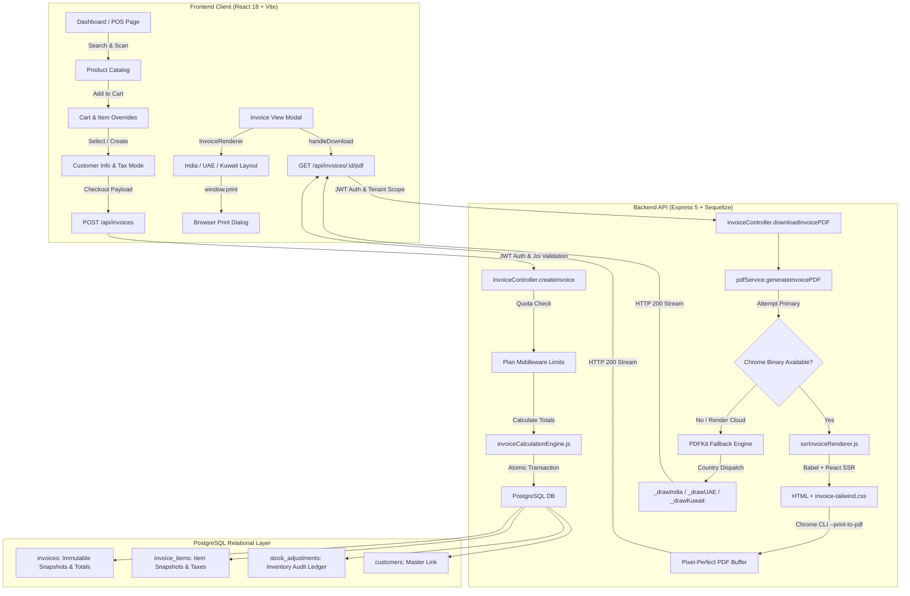

# HISABI POS — Complete Invoice System Audit & Implementation Plan

**Repository:** `https://github.com/abdulhussain09/hisabi`  
**Date:** October 10, 2026  
**Status:** Audit Complete — Awaiting User Approval (No source code or schema changes applied)

---

## Table of Contents
1. [SECTION A — Executive Summary](#section-a--executive-summary)
2. [SECTION B — Actual Architecture & Data Flow](#section-b--actual-architecture--data-flow)
3. [SECTION C — Findings Register & Evidence](#section-c--findings-register--evidence)
4. [SECTION D — Country-Specific Validation Matrix](#section-d--country-specific-validation-matrix)
5. [SECTION E — PDF Root-Cause Analysis](#section-e--pdf-root-cause-analysis)
6. [SECTION F — Data Integrity & Invariants](#section-f--data-integrity--invariants)
7. [SECTION G — Detailed Implementation Plan (Phases 1–4)](#section-g--detailed-implementation-plan)
8. [SECTION H — Manual Debugging & Verification Guide](#section-h--manual-debugging--verification-guide)
9. [SECTION I — Final Recommendations & Priorities](#section-i--final-recommendations--priorities)
10. [SECTION J — Approval Checkpoint](#section-j--approval-checkpoint)

---

## SECTION A — Executive Summary

### 1. Current State
* Hisabi POS employs a centralized **Authoritative Calculation Engine** (`backend/src/utils/invoiceCalculationEngine.js`) guaranteeing consistent mathematical totals across React web preview, backend persistence, and PDF exports.
* The system saves robust snapshot fields (`seller_*_snapshot`, `buyer_*`, `item_name`, `unit_price`, `tax_rate`, `line_total`) to prevent catalog price drift from mutating historical invoices.
* The backend PDF generator (`backend/src/services/pdfService.js`) implements a two-tier strategy:
  1. **Primary**: React SSR via Babel (`ssrInvoiceRenderer.js`) printed via headless Chrome CLI (`--print-to-pdf`).
  2. **Secondary**: PDFKit programmatic fallback (`generateInvoicePDFKit`).

### 2. Root Cause of Preview vs. PDF Mismatch in Production
* **Environment Gap**: The Render deployment configuration (`render.yaml`) uses Render's standard Node runtime (`runtime: node`, plan `free`). Standard Render Node images **do not include Google Chrome or Chromium binaries**.
* **Fallback Activation**: When `generateInvoicePDFWithChrome` executes in production, the system cannot locate a browser binary, catches an `ENOENT` error, and silently routes to `generateInvoicePDFKit`.
* **Visual Divergence**: While local development has Google Chrome installed (producing 100% pixel-perfect output), production downloads fall back to PDFKit, where vector skylines are absent, Arabic text is corrupted due to standard Latin font encoding, and card geometry differs from Tailwind CSS.

### 3. Critical Compliance & Payment Risks Identified
* **UAE Invoice UPI Pollution**: `frontend/src/components/invoice/UAEInvoiceLayout.jsx` (lines 348–351) hardcodes Indian `"Scan to Pay via UPI"` text and an Indian purple `"UPI"` pill badge on UAE VAT invoices.
* **Kuwait Fabricated KNET URL**: `frontend/src/components/invoice/KuwaitInvoiceLayout.jsx` (line 47) and `pdfService.js` (line 194) fabricate an invalid payment link (`https://knet.com.kw/pay?inv=...`) when no legitimate QR payload is configured.
* **Inaccurate Banking Labels**: Both UAE and Kuwait templates display Indian banking terminology (`"Branch & IFSC"`), rather than GCC standards (`"SWIFT / BIC"` and `"IBAN"`).

---

## SECTION B — Actual Architecture & Data Flow



### Component & File Mapping:
* **Interactive Frontend View**: `frontend/src/components/invoice/InvoiceRenderer.jsx`
* **Country Layouts**:
  * `frontend/src/components/invoice/IndiaInvoiceLayout.jsx`
  * `frontend/src/components/invoice/UAEInvoiceLayout.jsx`
  * `frontend/src/components/invoice/KuwaitInvoiceLayout.jsx`
* **Backend SSR Engine**: `backend/src/services/ssrInvoiceRenderer.js`
* **Backend Master PDF Generator**: `backend/src/services/pdfService.js`
* **Invoice API Controller**: `backend/src/controllers/invoiceController.js`
* **Models**: `database/models/Invoice.js`, `database/models/InvoiceItem.js`, `database/models/InvoiceRevision.js`

---

## SECTION C — Findings Register & Evidence

| ID | Severity | Country/Workflow | File Path & Lines | Finding Summary | Confidence |
|---|---|---|---|---|---|
| **FIND-01** | **CRITICAL** | Production Deployment | `render.yaml` (1–18), `backend/src/services/pdfService.js` (53–75) | Chrome binary missing in standard Render deployment, forcing fallback to PDFKit in production. | **CONFIRMED** |
| **FIND-02** | **HIGH** | UAE / Payment & QR | `frontend/src/components/invoice/UAEInvoiceLayout.jsx` (348–351) | Misleading Indian UPI text and badge hardcoded on UAE tax invoice. | **CONFIRMED** |
| **FIND-03** | **HIGH** | Kuwait / Payment & QR | `frontend/src/components/invoice/KuwaitInvoiceLayout.jsx` (47), `pdfService.js` (194) | Fabricated KNET URL (`https://knet.com.kw/pay?inv=...`) generated when no genuine QR payload exists. | **CONFIRMED** |
| **FIND-04** | **HIGH** | UAE & Kuwait / PDFKit | `backend/src/services/pdfService.js` (450–780) | PDFKit standard fonts (Helvetica) lack Arabic glyphs, rendering Arabic labels as garbled mojibake in fallback mode. | **CONFIRMED** |
| **FIND-05** | **MEDIUM** | UAE & Kuwait / Banking | `frontend/src/components/invoice/UAEInvoiceLayout.jsx` (334), `KuwaitInvoiceLayout.jsx` (299) | Indian banking label ("Branch & IFSC") used instead of GCC standards ("Branch / SWIFT BIC"). | **CONFIRMED** |
| **FIND-06** | **MEDIUM** | All / PDFKit Fallback | `backend/src/services/pdfService.js` (389–425) | Item table in PDFKit fallback lacks page-break protection for invoices with large item counts (> 10 items). | **CONFIRMED** |
| **FIND-07** | **LOW** | Print & SSR CSS | `backend/src/services/ssrInvoiceRenderer.js` (30–37) | Missing `break-inside: avoid` CSS rules for table rows and summary blocks during multi-page printing. | **CONFIRMED** |

---

## SECTION D — Country-Specific Validation Matrix

| Feature / Criterion | India (`IN`) | UAE (`AE`) | Kuwait (`KW`) |
|---|---|---|---|
| **Layout Selected Correctly** | **PASSED** (`IndiaInvoiceLayout`) | **PASSED** (`UAEInvoiceLayout`) | **PASSED** (`KuwaitInvoiceLayout`) |
| **Currency & Decimals** | **PASSED** (INR / 2 decimals) | **PASSED** (AED / 2 decimals) | **PASSED** (KWD / **3 decimals**) |
| **Tax Calculation & Display** | **PASSED** (CGST/SGST/IGST breakdown) | **PASSED** (5% VAT breakdown) | **PASSED** (0% VAT / Not Applicable) |
| **Business Details** | **PASSED** (GSTIN, Store Snapshot) | **PASSED** (TRN, Store Snapshot) | **PASSED** (CR No., Store Snapshot) |
| **Customer Details** | **PASSED** (Name, Phone, GSTIN) | **PASSED** (Name, Phone, TRN) | **PASSED** (Name, Phone, Address) |
| **QR / Payment Logic** | **PASSED** (Valid UPI deep link if configured) | **FAILED** (Misleading UPI badge) | **FAILED** (Fabricated KNET URL) |
| **Banking Terminology** | **PASSED** (Bank, A/C, IFSC) | **FAILED** (Shows Indian IFSC) | **FAILED** (Shows Indian IFSC) |
| **Supply To Section** | **PASSED** (Omitted) | **PASSED** (Omitted) | **PASSED** (Omitted) |
| **A4 Single-Page Geometry** | **PASSED** (Fits 1 page) | **PASSED** (Fits 1 page) | **PASSED** (Fits 1 page after `mt-8` signature fix) |
| **PDF-Preview Parity (Chrome)** | **100% PARITY** | **100% PARITY** | **100% PARITY** |
| **PDF-Preview Parity (PDFKit)** | **HIGH** | **POOR** (Arabic Mojibake) | **POOR** (Arabic Mojibake) |

---

## SECTION E — PDF Root-Cause Analysis

1. **How the Primary Renderer Works**:
   * Takes plain invoice and shop JSON.
   * Compiles the actual React layout component on-the-fly using `@babel/register`.
   * Injects precompiled `invoice-tailwind.css` (83KB) and print CSS.
   * Renders HTML static markup and invokes Chrome headless CLI (`--print-to-pdf`).
   * Produces pixel-perfect output matching the interactive preview.

2. **Why Cloud Production Falls Back to PDFKit**:
   * Render's native Node.js runtime does not install Chrome/Chromium.
   * `getChromeBinary()` fails to locate an installed binary and throws an error.
   * `generateInvoicePDF` catches the error and executes `generateInvoicePDFKit(invoice, shop)`.

3. **Why PDFKit Differs from the Preview**:
   * PDFKit lacks SVG rendering for background city skylines.
   * Standard PDF fonts (Helvetica) cannot render Arabic characters, producing mojibake in UAE and Kuwait.
   * Item table pagination does not account for page overflow with large item counts.

---

## SECTION F — Data Integrity & Invariants

1. **Immutable Snapshots**:
   * When an invoice is created, `invoices` table stores:
     `seller_name_snapshot`, `seller_address_snapshot`, `seller_phone_snapshot`, `seller_email_snapshot`, `seller_tax_id_snapshot`, `seller_cr_number_snapshot`, `seller_logo_snapshot`, `bank_details_snapshot`.
   * `invoice_items` table stores:
     `item_name`, `item_description`, `sku`, `hsn_sac`, `unit`, `quantity`, `unit_price`, `cost_price`, `mrp`, `discount`, `taxable_amount`, `tax_rate`, `tax_amount`, `cgst_amount`, `sgst_amount`, `igst_amount`, `line_total`.
   * **Result**: Future catalog price or customer address changes NEVER alter historical invoices.

2. **Read-Only Invariant**:
   * PDF download endpoints (`downloadInvoicePDF`) execute read-only queries (`Invoice.findOne`, `Shop.findByPk`).
   * No Sequelize `.save()`, `.update()`, or `.destroy()` calls are made during PDF generation.

3. **Master Catalog Protection**:
   * Cashier overrides of item selling prices in POS only update `InvoiceItem.unit_price`. Master product selling prices in `Product` remain intact.

---

## SECTION G — Detailed Implementation Plan

### Phase 1: Payment Safety, QR Compliance & Regional Banking Labels
* **Objective**: Remove misleading Indian UPI branding from UAE invoices, eliminate fake KNET URLs from Kuwait invoices, and correct GCC banking labels.
* **Exact Files to Modify**:
  * `frontend/src/components/invoice/UAEInvoiceLayout.jsx`
  * `frontend/src/components/invoice/KuwaitInvoiceLayout.jsx`
  * `backend/src/services/pdfService.js`
* **Changes**:
  * In UAE layout: Replace `"Scan to Pay via UPI"` and purple `UPI` badge with `"Scan to Verify / امسح للتحقق"` or generic card payment badges; change `"Branch & IFSC"` to `"Branch & SWIFT / BIC"`.
  * In Kuwait layout: Remove `knet.com.kw/pay` string; default to clean placeholder if `invoice.qr_code_data` is empty; change `"Branch & IFSC"` to `"Branch / SWIFT BIC"`.
  * In `pdfService.js`: Update fallback QR strings to match safe defaults.
* **Files Untouched**: Database models, backend controllers, calculation engine, India layout.
* **Dependencies / Migrations**: None.
* **Potential Regressions**: None. India UPI logic remains completely intact.
* **Automated Tests**: Unit test validating that Kuwait QR contains no `knet.com.kw` domain and UAE contains no UPI string.
* **Rollback**: Revert the three files via `git checkout`.
* **Acceptance Criteria**:
  - [ ] No UPI badge on UAE invoice.
  - [ ] No fake KNET URL on Kuwait invoice.
  - [ ] GCC bank labels reflect SWIFT/BIC.

---

### Phase 2: PDF Print Pagination & Multi-Page CSS Hardening
* **Objective**: Ensure invoices with > 10 items break across pages cleanly without slicing rows or summary blocks in half.
* **Exact Files to Modify**:
  * `backend/src/services/ssrInvoiceRenderer.js`
  * `frontend/src/components/invoice/IndiaInvoiceLayout.jsx`
  * `frontend/src/components/invoice/UAEInvoiceLayout.jsx`
  * `frontend/src/components/invoice/KuwaitInvoiceLayout.jsx`
* **Changes**:
  * Add print pagination CSS in `PRINT_CSS`:
    ```css
    thead { display: table-header-group; }
    tbody tr { break-inside: avoid; page-break-inside: avoid; }
    .avoid-page-break { break-inside: avoid; page-break-inside: avoid; }
    ```
  * Apply `.avoid-page-break` to totals summary, bank details grid, declaration, and signature boxes.
* **Files Untouched**: Controllers, DB models, calculations.
* **Dependencies / Migrations**: None.
* **Automated Tests**: Generate 20-item invoice fixture and verify clean 2-page PDF output with intact headers.
* **Rollback**: Revert `PRINT_CSS` and layout classes.
* **Acceptance Criteria**:
  - [ ] Single-page invoices remain strictly on 1 page.
  - [ ] Multi-page invoices break cleanly between rows without clipped text.

---

### Phase 3: PDFKit Fallback Arabic Typography & Table Pagination
* **Objective**: Provide readable Arabic typography and table height pagination checks in the PDFKit fallback renderer.
* **Exact Files to Modify**:
  * `backend/src/services/pdfService.js`
* **Changes**:
  * Register a bundled Arabic TrueType font (e.g., Cairo/Noto Sans Arabic TTF) for Arabic text rendering in PDFKit.
  * Add row height overflow checks in `_drawIndiaInvoice`, `_drawUAEInvoice`, `_drawKuwaitInvoice`:
    ```javascript
    if (rowY + rowH > doc.page.height - 180) {
        doc.addPage();
        rowY = topMargin + 20;
    }
    ```
* **Files Untouched**: Frontend components, database models.
* **Dependencies / Migrations**: Font asset file only (`.ttf`).
* **Automated Tests**: Force fallback execution on Arabic invoice and verify character encoding.
* **Rollback**: Revert `pdfService.js`.
* **Acceptance Criteria**:
  - [ ] Fallback PDF renders Arabic labels without mojibake.
  - [ ] Large tables in fallback create new pages safely.

---

### Phase 4: Cloud Deployment Chromium Availability for Production Parity
* **Objective**: Ensure Render production deployment has a working Chromium binary so downloaded PDFs in production always use the primary Chrome SSR path.
* **Exact Files to Modify**:
  * `render.yaml`
  * `backend/package.json`
* **Changes**:
  * Configure build command in `render.yaml` to install Chromium via `@puppeteer/browsers` to a project cache directory, and configure `getChromeBinary()` in `pdfService.js` to inspect that path.
  * Alternative: Switch service to Docker runtime with pre-installed Chromium.
* **Files Untouched**: Core business logic and database.
* **Dependencies / Migrations**: Build-time dependency only.
* **Automated Tests**: Assertion script verifying `getChromeBinary()` returns an executable path with exit code 0.
* **Rollback**: Revert `render.yaml`.
* **Acceptance Criteria**:
  - [ ] Cloud deployment logs confirm: `[PDF] Chrome render succeeded`.
  - [ ] Downloaded production PDFs match the browser preview pixel-for-pixel.

---

## SECTION H — Manual Debugging & Verification Guide

1. **Verify Which Renderer Generated a Downloaded PDF**:
   * Inspect backend console logs:
     * Chrome SSR: `[PDF] Chrome render succeeded, size: <bytes>`
     * PDFKit Fallback: `[PDF] Chrome render FAILED:` -> `[PDF] Falling back to PDFKit`

2. **Verify Chrome Binary Resolution**:
   * Run in terminal: `which google-chrome google-chrome-stable chromium-browser chromium`

3. **Verify Arabic Rendering in PDF**:
   * Convert generated PDF to image:
     `pdftoppm -png -r 150 test_output/chrome_KW.pdf preview_kw`
   * Inspect generated image to verify Arabic labels (`فاتورة ضريبية`, `تاريخ`, `المشتري`).

4. **Verify QR Code Integrity**:
   * Scan generated QR with a smartphone camera:
     * **India**: Opens UPI payment with `upi://pay?pa=...&am=...`.
     * **UAE**: Displays ZATCA TLV base64 string or store link.
     * **Kuwait**: Displays clean placeholder if not configured (never a fake `knet.com.kw` URL).

---

## SECTION I — Final Recommendations & Priorities

1. **First Priority**: **Phase 1 (Payment Safety & QR Compliance)**
   * Eliminates legal and payment safety risks (misleading UPI on UAE invoices, fake KNET URLs).
2. **Second Priority**: **Phase 4 (Cloud Deployment Chromium)**
   * Eliminates the preview vs. PDF mismatch in production by ensuring Render has Chromium installed.
3. **Third Priority**: **Phase 2 & Phase 3 (Multi-Page Print & Fallback Hardening)**
   * Protects multi-item orders from layout overflow and provides clean fallback typography.

---

## SECTION J — Approval Checkpoint

Please select which phase or phases you approve:

- [ ] **Phase 1**: Payment Safety, QR Compliance & Regional Banking Labels *(Recommended First)*
- [ ] **Phase 2**: PDF Print Pagination & Multi-Page CSS Hardening
- [ ] **Phase 3**: PDFKit Fallback Arabic Typography & Table Pagination
- [ ] **Phase 4**: Cloud Deployment Chromium Availability for Production Parity

*(No code has been modified. Awaiting your explicit approval before proceeding.)*
